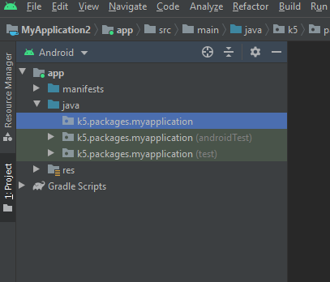
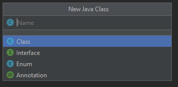
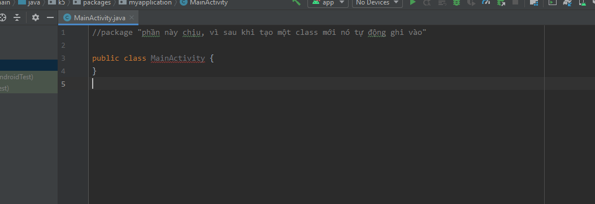
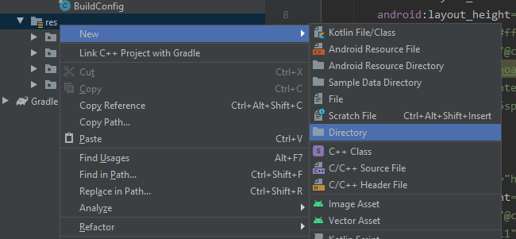
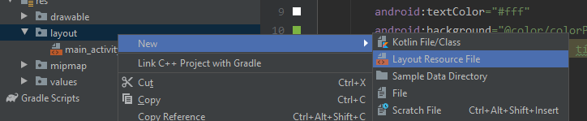
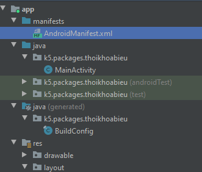
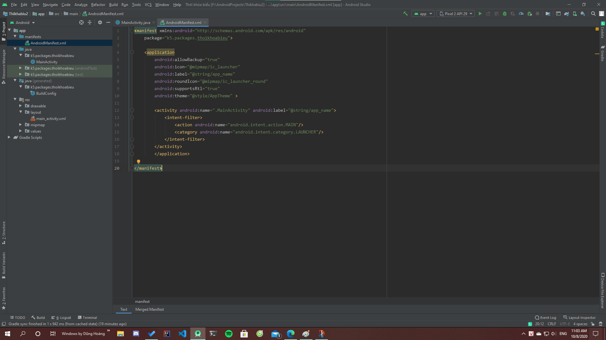
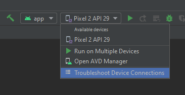
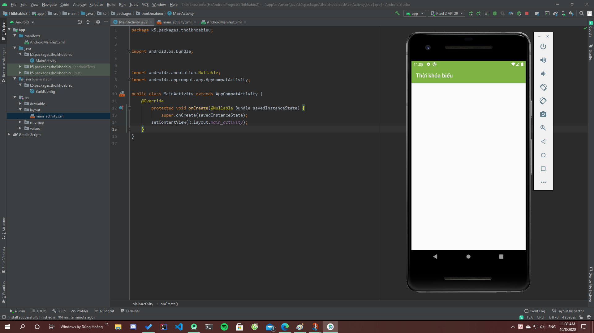

# Tạo mới 1 activity trong Android Studio


- Đầu tiên hay tạo một Project mới 
- Sau đó chọn phần noActivity để tạo 1 Project trắng
- Rồi sau đó bạn tự mò =))
 ## Tiếp theo là gì?
 - Tìm đến package chính của Project như hình dưới đây:
 
<p align="center">
  
</p>

- Nhấn chuột phải, chọn New>JavaClass
<p align="center">
  
</p>

- Đặt tên cho Class mới, lưu ý là phải viết hoa chữ cái đầu tiên đấy nhé =)) và đặt tên như thế nào cho ra dáng 1 MainActivity =))
<p align="center">
  
</p>

## Phần viết CODE
- Sau khi tạo mới 1 Class, Android Studio nó trông giống như thế này:
<p align="center">
  
</p>

- Từ từ, file Java này chưa được gọi là một Activity, phải kế thừa nó trong thư viện Acompat Activity 
> import androidx.appcompat.app.AppCompatActivity;

> public class MainActivity extends AppCompatActivity{ //đã được thêm extends AppcompatActivity

> } 
- Thêm thuộc tính onCreate
> import android.os.Bundle;            // Nhớ phải import 2 thư viện này \n
> import androidx.annotation.Nullable; \n
> @Override
> protected void onCreate(@Nullable Bundle savedInstanceState) {
> super.onCreate(savedInstanceState);
> }

- Thêm phương thức setContentView
> setContentView(R.layout.main_activity);  

- Từ từ, hình như thiếu gì đó, à, file XML của layout
Ta tạo 1 thư mục mang tên layout trong Drawable
<p align="center">
  
</p>
- Tạo 1 file XML có tên là main_activity (thật ra tên nào cũng được nhưng phải khai báo trong setContentView)

<p align="center">
  
</p>

- À quên mất :)) Activity này chưa chạy được do chưa được định nghĩa trong Android Manifest
Tìm đến file AndroidManifest.xml trong thư mục manifest
<p align="center">
  
</p>

- Thêm dòng này trong thẻ Application
> ```xml<activity android:name=".MainActivity" android:label="@string/app_name">```
> ```xml<intent-filter>```
> ```xml<action android:name="android.intent.action.MAIN"/>```
> ```xml<category android:name="android.intent.category.LAUNCHER"/>```
> ```xml</intent-filter>```
> ```xml</activity>```

Để cho dễ hình dung hơn thì xem hình dưới đây
<p align="center">
  
</p>
## Chạy thử App
- Chọn máy đã được đặt sẵn chế độ debug, nhưng nhớ là phải có kết nối với PC và Android Studio nhận diện ra máy đó
<p align="center">
  </p>

<p align="center">
  </p>

```xml
<myxml>
   <someElement />  
</myxml>
```


