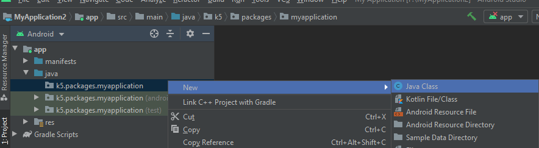

# Tạo mới 1 activity trong Android Studio

- Đầu tiên hay tạo một Project mới 
- Sau đó chọn phần noActivity để tạo 1 Project trắng
- Rồi sau đó bạn tự mò =))
 ## Tiếp theo là gì?
 - Tìm đến package chính của Project như hình dưới đây:
 

  

- Nhấn chuột phải, chọn New>JavaClass

  

- Đặt tên cho Class mới, lưu ý là phải viết hoa chữ cái đầu tiên đấy nhé =)) và đặt tên như thế nào cho ra dáng 1 MainActivity =))

  

## Phần viết CODE
- Sau khi tạo mới 1 Class, Android Studio nó trông giống như thế này:

  

- Từ từ, file Java này chưa được gọi là một Activity, phải kế thừa nó trong thư viện Acompat Activity 
> import androidx.appcompat.app.AppCompatActivity;

> public class MainActivity extends AppCompatActivity{ //đã được thêm extends AppcompatActivity

> } 

